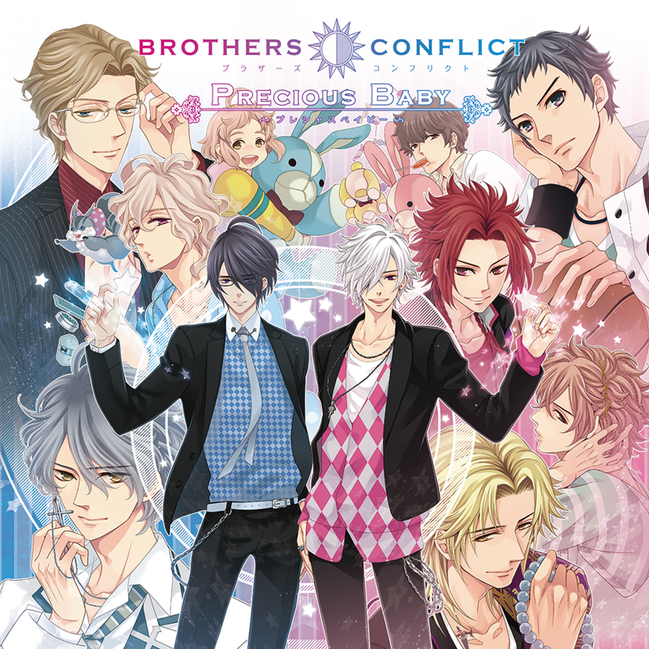
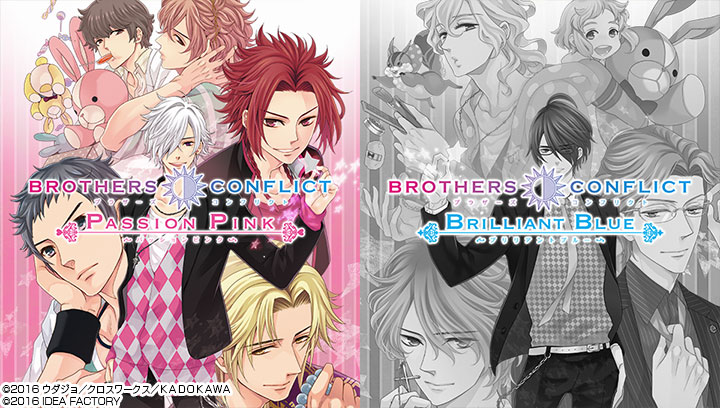
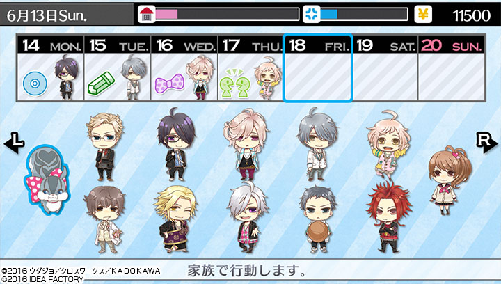
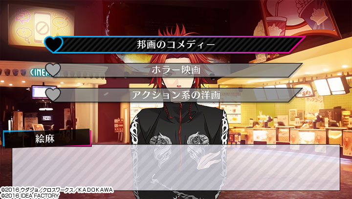
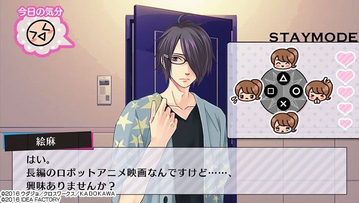

# Brothers Conflict: Precious Baby - Fan Localization Patch for PS Vita

**Brothers Conflict: Precious Baby** is an otome game developed by Otomate that was first released on PS Vita on 4/7/2016. It combines both Passion Pink and Brilliant Blue, which were previously released on PSP on 5/17/2012 and 9/12/2013 respectively. It has since been ported to the Nintendo Switch on 8/29/2019.

**Brilliant Blue**: Ukyo, Azusa, Louis, Iori, Wataru & Natsume Routes 
**Passion Pink**: Masaomi, Kaname, Hikaru, Tsubaki, Subaru, Yusuke & Fuuto Routes 
*There are some secret routes/endings as well!*

This fan localization patch is for the PS Vita version of the game.

**Game Opening Videos (Youtube)**: [**Passion Pink**](https://www.youtube.com/watch?v=6Cfo2JJ75PI) | [**Brilliant Blue**](https://www.youtube.com/watch?v=SrsZ8twFrRE)

### PLEASE NOTE THE BELOW

#### BUGS 😔

* **There is still one major bug with Kaname's route where some of the translations for the overnight stay events do not show up. As we were unable to fix this bug, we will be releasing scripts for the overnight stay events. The scripts can be accessed [here](https://github.com/AsahinaKyoudai/BrothersConflict/blob/c84701d25b869cf8f742c69abdc7fea68a4ed63d/Kaname_Overnight%20Stay%20Scripts_20220101.pdf).**
* **Event names either show up in Japanese or do not show up at all. Unfortunately, translating them caused some events not to trigger.**

#### QA / Error Submission

* Many contributors have worked on this project throughout the years. The project was revived about two years ago, and since then, our Japanese and English proofreaders have been diligently scrubbing through all scripts to ensure an accurate and consistent translation. As such, some scripts have been heavily edited from the original translations in our patch. Our team has also translated the remainder of the Passion Pink and Brilliant Blue scripts.
* This is a fan localization done by passionate volunteers. Although our team did a second proofread of all existing scripts and even retranslated some, we were unable to do Japanese proofreading for every single script due to bandwidth, especially for the Passion Pink scripts by [**Passion & Brilliance**](https://passionandbrilliance.tumblr.com/).
* Please be patient with us if you do spot any issues, and we hope you contribute to this patch by reporting the errors through our [**Error Submission Form**](https://forms.gle/3QtQBDKY1bXoJFvf8)!
*Please note that you must have a Google account to access this form due to Google requirements on image uploads.*

### FAQ

Here is our current list of FAQ questions! We will keep adding to the FAQ list here as we get more inquiries about the patch.

#### What do I need to play the game?

* A hacked PS Vita with sufficient storage space for the patch (~3 GB)
* A copy of the game (**PS Vita version only**)
* A copy of the patch **(Please refer back to this GitHub repository for the latest version.)**
* A Vita-compatible micro USB cable
* A computer/laptop for uploading the patch

#### How does the patch work?

Our patch can only be played with a modded PS Vita and a copy of **Brothers Conflict: Precious Baby**¹. You may choose to purchase a device that is already modded, or you can follow a guide for an unmodded device, such as this [PS Vita (TV) Hacks Guide](https://vita.hacks.guide/) or this [Reddit post + guide on VitaDeploy](https://www.reddit.com/r/vitahacks/comments/meg7sp/release_vitadeploy_a_toolbox_that_makes/).

Please note that modding your PS Vita comes with the risk of permanently bricking your device during the process. Although rare, you should understand all risks involved before proceeding and be sure to follow all instructions exactly. Under no circumstances will Otogelib or its community be held responsible or liable in any way for any damages to your device as a result of your own actions.

Instructions on how to patch a PS Vita game can be found [**here**](https://docs.google.com/document/d/144LNdl8hE2pPmQPyma3l8BSF_47ezorE/edit?usp=sharing&ouid=111035187415794645473&rtpof=true&sd=true).

##### Although there is a Nintendo Switch version of Brothers Conflict: Precious Baby, we will only release a patch for the PS Vita version.

*¹ Can be either physical or digital. If you are using a sd2vita memory card adapter rather than an official PS Vita memory card, you will be unable to use a physical game card.*

#### Will a walkthrough be available?
We have a detailed walkthrough that we put together for our beta testers that was a translation of a Japanese walkthrough. This is available upon request, but may have some slight differences in-game. If there is enough demand, then we may clean up this copy and release it, or we may consider creating a more general guide.

We highly recommend that you check out the brother profiles in-game for tips on favorite foods/activities and any other brothers that you may need to build a relationship with! Juli's advice on each profile will change throughout the route as well.

We highly encourage walkthroughs if anyone would like to create one in English! If anyone has any questions about routes, game mechanics, etc, then feel free to reach out to us on [**Twitter**](https://twitter.com/TeamAsahina)!

#### Will text translations be uploaded?

Not at this time. However, we may consider publishing text translations for Brilliant Blue if there is enough demand.

### Credits

This project could not have been possible without everyone's hard work and support.

**TL**: Jennifer, [Jokertrap-ran](https://jokertrap-ran.tumblr.com/), jaosy, Kaze, nids, Skye, [Passion & Brilliance](https://passionandbrilliance.tumblr.com/) 
**PR**: 507, dia, glowingbutterfly, Lyla Snowlocke, Juju, kuririn 
**Graphics**: jaosy, Jennifer, Tomatouji, yuugs 
**Closed Beta Testing**: Jennifer, kuririn, nat *(more to credit, just waiting on name confirmations!)* 
**Tech Support**: [[DC]](https://ko-fi.com/0xdc00)

**Special Thanks**
* Reishiki for all of her help throughout this entire process!!! This patch release could not have been possible without her support! 
* Everyone that contributed to the project in any way over the years! 
* The otome community for your excitement, support, and patience!

If you've contributed to at least one full script and haven't been credited, then please DM us on [**Twitter**](https://twitter.com/teamasahina)!

### More BroCon!

Here are some other ways to enjoy the series!

- The games are originally based off of a [Japanese light novel series](https://www.amazon.co.jp/dp/B074CFS5VG) of the same name.
- There is an [anime adaptation](https://www.funimation.com/shows/brothers-conflict/) that has been localized!
- There are many [manga adaptations](https://www.amazon.co.jp/s?i=digital-text&rh=p_27%3A%E3%82%A6%E3%83%80%E3%82%B8%E3%83%A7) and [drama CDs](https://www.amazon.co.jp/s?k=%E3%83%89%E3%83%A9%E3%83%9ECD+BROTHERS+CONFLICT) available as well.
- There is a [manga series](https://www.amazon.co.jp/dp/B07BHYGHL1) in the same universe called Fortissimo, which has an [otome game adaptation (PS Vita)](https://vndb.org/v18212). Fuuto makes an appearance in the series.

# GAME INFORMATION

## STORY

Following her father’s remarriage, the protagonist takes on the Asahina family name and *moves in with her new brothers*.

However, her presence in the large all-male household causes strife within the previously harmonious family, as the brothers begin to develop feelings for their new stepsister and start viewing each other as rivals in love...

This is a **story of forbidden love** between **siblings** that live under the same roof! How will this tale unfold?

## CHARACTERS

 
**Ema** (name changeable) 
Age: 16 
Occupation: 2nd year student in high school

Just an ordinary girl that goes to Hinode High School. 
Her mother passed away when she was young and her father is an adventurer that travels a lot, so she's used to being alone. 
Due to her father's remarriage, she gains 13 new siblings.

 
**Juli** (VA: Hiroshi Kamiya) 

> I don't trust any of the brothers in this family! Not one bit!

The protagonist's pet squirrel (♂). 
They seem to be able to communicate with each other...

 
**Masaomi** (VA: Kazuyuki Okitsu) 
Age: 31 
Occupation: Doctor (Pediatrician) 
Birthday: April 24th 
Blood Type: O 
Height: 179 cm

> I'm actually a doctor. I specialize in pediatrics though.

The oldest son of the Asahina family. 
He is a kind, gentle, and carefree man that rarely gets angry.

 
**Ukyo** (VA: Daisuke Hirakawa) 
Age: 28 
Occupation: Lawyer 
Birthday: December 3rd 
Blood Type: AB 
Height: 182 cm

> If you run into any issues, please let me know right away. I will help you out.

The dependable second son of the Asahina family. 
He is always composed but can be direct and to the point. 
He often looks over the brothers and has a motherly prescence.

 
**Kaname** (VA: Junichi Suwabe) 
Age: 26 
Occupation: Buddhist Monk 
Birthday: May 28th 
Blood Type: O 
Height: 185 cm

> You're so cute, Little Sis~♪ Next time, can I kiss you somewhere other than your hand?

Not your typical monk. 
His love for women is unparalleled, and he acts like he's from a host club. 
There's an endless line of women that would love one of his one-on-one "Dharma talks" with his own unique intrepretation.

 
**Hikaru** (VA: Nobuhiko Okamoto) 
Age: 25 
Occupation: Author 
Birthday: August 1st 
Blood Type: O 
Height: 175 cm

> So everyone finds you pretty important. I'm getting a bit interested in you too.

The 4th son of the Asahina family who crossdresses for some reason. 
It seems like he was living overseas for research purposes...

 
**Tsubaki** (VA: Kenichi Suzumura) 
Age: 24 
Occupation: Voice Actor 
Birthday: December 31st 
Blood Type: A 
Height: 176 cm

> That got me so excited! Hey, can I hug you one more time?

A young voice actor that is marketed along with Azusa as a pair. 
He's often cynical and always acts easygoing, but he also has a serious side and is very hardworking and sincere when it comes to his job. 
He loves his younger brother (Azusa) more than anyone else.

 
**Azusa** (VA: Kosuke Toriumi) 
Age: 24 
Occupation: Voice Actor 
Birthday: December 31st 
Blood Type: A 
Height: 176 cm

> If Tsubaki ever bothers you again, let me know. I'll put him in check.

A young voice actor that has gained sudden popularity. He is quiet and calm. 
He can excel in anything quickly, so he loses interest in things quickly and doesn't feel attached to anything in particular. 
He loves his older brother (Tsubaki) more than anyone else.

 
**Natsume** (VA: Tomoaki Maeno) 
Age: 24 
Occupation: Office Worker 
Birthday: January 1st 
Blood Type: A 
Height: 176 cm

> ...Who are you? A stranger shouldn't call someone by their first name so casually.

Triplets with Tsubaki and Azusa, though Tsubaki and Azusa are identical twins while he is the only fraternal one. 
He's usually blunt and acts like a lone wolf. He currently lives alone, away from the rest of his family.

 
**Louis** (VA: Ken Takeuchi) 
Age: 21 
Occupation: Beautician 
Birthday: February 22nd 
Blood Type: B 
Height: 174 cm

> It'd be a shame to leave your hair like that since you dressed up so nicely today... I want to style it for you...

A charismatic beautician that works at a famous beauty salon. 
He's a bit eccentric and he tends to zone out a lot and does everything at his own pace. 
Since he's always quiet and doesn't show much emotion in his expression or behavior, it's hard to tell what he's actually thinking.

 
**Subaru** (VA: Daisuke Ono) 
Age: 19 
Occupation: 2nd Year University Student 
Birthday: September 21st 
Blood Type: O 
Height: 183 cm

> ...You're so thin. Are you eating properly?

A 2nd year university student that is dedicated to basketball. 
He is stoic and straightforward in everything that he does. 
He's been single-mindedly focused on sports since he was young, so he's not used to women and doesn't know how to act around them.

 
**Iori** (VA: Daisuke Namikawa) 
Age: 18 
Occupation: 3rd Year High School Student 
Birthday: April 17th 
Blood Type: A 
Height: 175 cm

> I know very well that you're always doing your best.

A diligent and kind honors student that goes to a Catholic school. 
He's so popular that even girls from other schools know of him.

 
**Yusuke** (VA: Yoshimasa Hosoya) 
Age: 16 
Occupation: 2nd Year High School Student 
Birthday: March 31st 
Blood Type: O 
Height: 173 cm

> Becomin' siblings with my classmate?! That ain't right!!!

Classmates with the protagonist. 
He may look and act like a delinquent, but he's really just doing his best to act manly. He hates anything unjust.

 
**Fuuto** (VA: KENN) 
Age: 14 
Occupation: Idol / 3rd Year Junior High School Student 
Birthday: July 7th 
Blood Type: B 
Height: 168 cm

> You're...kind of cute in your own way, but you seem kind of dumb.

He's a very popular idol that's all over TV. 
Since he has to juggle both work and school, he is rarely at home. 
He's cheeky and impudent.

 
**Wataru** (VA: Yuki Kaji) 
Age: 10 
Occupation: 5th Year Elementary School Student 
Birthday: January 3rd 
Blood Type: O 
Height: 140 cm

> Hehe! I just got a headpat from Big Sis!

The youngest child of the Asahina family. 
Although he is in the fifth grade, he looks much younger than his age and is often mistaken for a girl because of how cute he is. 
He is purehearted but tends to act spoiled.

 
**Rintaro Hinata** (VA: Masaki Terasoma) 

The protagonist's father. He's a professional adventurer. 
Although he is often away from home due to work, he cares for the protagonist very much.

 
**Miwa Asahina** (VA: Nahomi Iida) 

A successful career woman and mother of the Asahina siblings. 
She has a straightforward and bright personality, but she can be a bit pushy as times.

 
**Mahiko Imai** (VA: Saya Shinomiya) 

The protagonist's best friend and classmate. 
She calls the protagonist "Hina" because of her former surname "Hinata".

 
**Kazuma Sasakura** (VA: Kazunori Nomiya) 

Classmates with Mahoko and the protagonist. 
He and Yusuke are rivals since he secretly crushes on the protagonist as well.

### GALLERY

[Publicly Released CGs (Otomate)](https://www.otomate.jp/bc/pb/gallery/)

### SYSTEM

#### Gameplay

The game takes place over one year.

You can change the protagonist's first name. Her default name is Ema Asahina. You can input up to 3 characters.

You can choose between the Passion Pink and Brilliant Blue games on the title screen.

#### Events

Certain events will only occur if the brother is a love interest in that game.

There are events with multiple siblings as well. These events require both brother affection AND family affection. Some events occur in both games, while others only occur in one of the two games.

Choices can increase either brother affection or family affection.

#### Weekly Schedule

In addition to the story and brother events, there's also a simulation system where you can raise affection, earn money, go shopping, and reduce your fatigue.

You have to set your schedule every week. You can choose to spend time with the whole family (increase family affection), with one specific brother (increase brother affection), or by yourself. Additional activities can be selected on weekends and holidays (i.e., dates, overnight stays, shopping).

#### Dates

You can choose to go on a date on your days off.

##### Brother Date

You can visit your brother's room and invite him on a date. If he accepts, then you can choose to go to the aquarium, zoo, amusement park, shopping mall, movie theater, or park. After a period of time, you'll be able to select his room as a date spot as well.

You'll be given a choice during each date. His affection level may change depending on your answer.

##### Family Date

You can go on a date with the whole family. The brothers that appear are random and may depend on who the love interests are in the version you're playing.

Similar to the brother dates, you can pick between 6 locations. You will also be given a choice during each date. Family affection may change depending on your answer.

#### Overnight Stay

Once certain conditions are met, you'll be able to stay overnight at one of your brother's rooms on your days off. The brothers you can visit depend on who the love interests are for the version you are playing.

When you go to your brother's room, you'll see his mood in the upper left hand corner. Choose between four emotional expressions after considering the brother's personality and his words in order to get him to agree to you staying over! The gauge on the right will increase as you select the correct responses. If you succeed, then you'll be able to view the overnight stay event (the conversation will change depending on affection level). 

### MUSIC

#### Passion Pink

**Opening**: AFFECTIONS by Tsubaki & Azusa (Kenichi Suzumura & Kosuke Toriumi) 
**Ending**: SUNRISE DAYS by Tsubaki & Azusa (Kenichi Suzumura & Kosuke Toriumi)

[Spotify Link](https://open.spotify.com/album/2iFj8VhufYetIABA1U2VUy)

#### Brilliant Blue

**Opening**: JEALOUSNESS by Tsubaki, Azusa & Natsume (Kenichi Suzumura, Kosuke Toriumi & Tomoaki Maeno) 
**Ending**: INNOCENT BLUE by Tsubaki, Azusa & Natsume (Kenichi Suzumura, Kosuke Toriumi & Tomoaki Maeno)

[Spotify Link](https://open.spotify.com/album/0X93FC3KQ9XW7zJp2YdA07)

#### Character Themes

[Otomate Link](https://www.otomate.jp/bc/pb/sound/bgm.php)

### VIDEOS

* [Precious Baby PV](https://www.youtube.com/watch?v=Ji3MMe_NkVw)
* [Passion Pink Opening](https://www.youtube.com/watch?v=6Cfo2JJ75PI)
* [Brilliant Blue Opening](https://www.youtube.com/watch?v=SrsZ8twFrRE)
* [Precious Baby Otomate Party 2015 Announcement](https://www.youtube.com/watch?v=dsvWeRc_-ug)
